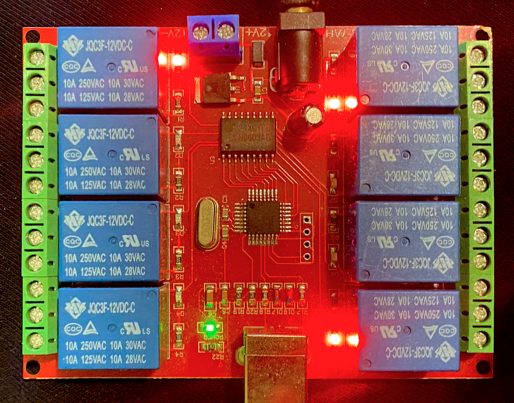
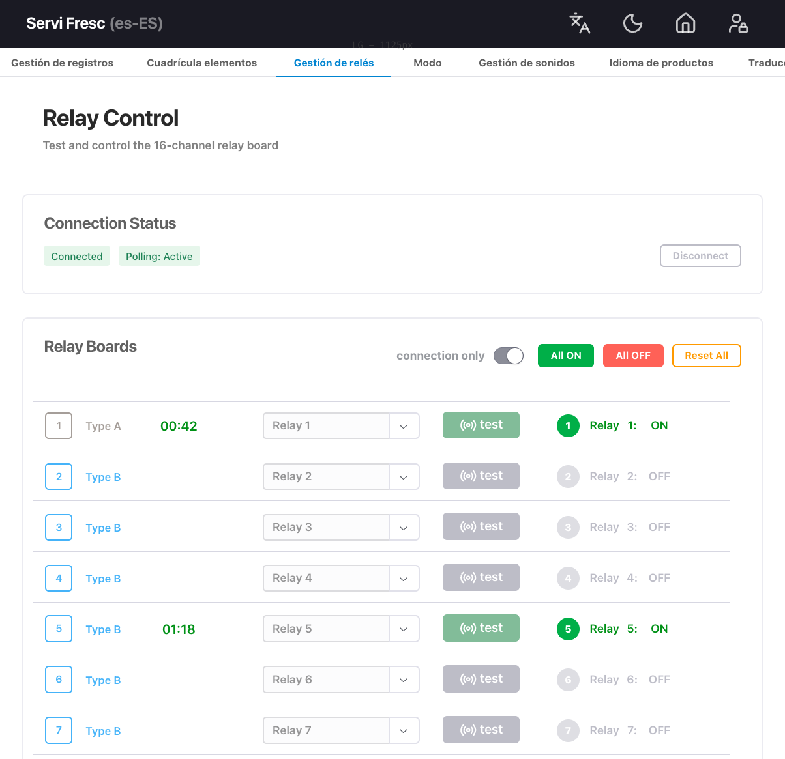
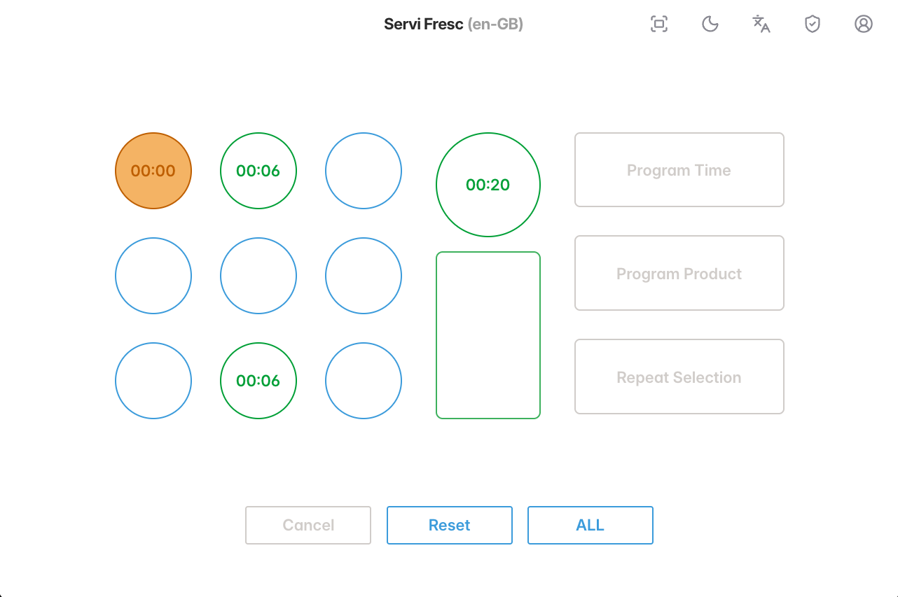

# touch-monorepo

> Full-stack TypeScript monorepo for an IoT-connected product management and operational control system.

A production-deployed application that manages physical beverage dispenser units through USB-connected relay
hardware. Operators configure cooling profiles, track active sessions, manage orders, and control hardware state
through a real-time web interface — all running on a Raspberry Pi at the edge.

---

## Stack at a Glance

| Layer         | Technology                                                                        |
| :------------ | :-------------------------------------------------------------------------------- |
| Workspace     | pnpm workspaces + Turborepo                                                       |
| Client        | Vite, React 18, React Router v7                                                   |
| Styling       | Panda CSS, Emotion, `@finografic/design-system`                                   |
| State         | TanStack Query v5, Zustand                                                        |
| Forms         | React Hook Form + Valibot                                                         |
| i18n          | i18next + react-i18next (EN / ES / CA), server-managed translations               |
| Server        | Hono, `@hono/node-server`                                                         |
| Database      | Drizzle ORM, better-sqlite3 (SQLite)                                              |
| Auth          | Auth.js (`@auth/core` + `@auth/drizzle-adapter`)                                  |
| Hardware      | USB HID relay boards (USBRelay8) via `node-hid` — up to 16 relays across 2 boards |
| Logging       | Pino (structured, request-level)                                                  |
| Env config    | Valibot-validated env, auto-resolved dotenv (`@workspace/config`)                 |
| Build         | tsdown (server), Vite (client)                                                    |
| Lint & format | ESLint 9 (flat config), Prettier                                                  |
| Git hooks     | simple-git-hooks + lint-staged + commitlint                                       |
| Testing       | Vitest                                                                            |
| Deployment    | Raspberry Pi 4 (Linux ARM64), cross-platform build CLI                            |

---

## What It Does

The system manages a fleet of dispensing units where each slot (tap) can be independently enabled or disabled
via a relay board. Operators interact through the web UI to:

- Configure slot assignments and cooling profiles
- Start and stop active dispensing sessions with real-time timers
- Manage orders, volumes, and container types
- Control relay state directly (enable / disable individual relays)
- Administer users, languages, and translation strings
- Monitor system health via API

Hardware state is managed by the server: USB relay boards do not report current state, so the server tracks
relay on/off state internally and resets all relays to OFF on startup.

---

## Relay Hardware in Detail

Each dispensing slot is wired to a channel on a **USBRelay8** board (also sold as the **HW-554**, 8-channel
12V USB HID relay module). One board gives 8 channels; the system supports **one or two boards connected at
once**, for up to 16 independently controlled slots.

<p align="center">
  
</p>

> Datasheet: [HW-554 / 200765 — 8 Channel 12V USB Control Switch](https://www.mantech.co.za/datasheets/products/HW-554-200765.pdf)

The board enumerates over USB HID (`0x16c0` / `0x05df`) — no custom driver needed, `node-hid` talks to it
directly. The server never has to guess which physical board is which: relays 1–8 always live on the first
board, relays 9–16 on the second, and each relay is switched with a 9-byte HID feature report (`0xff`/`0xfd`
for single-channel on/off, `0xfe`/`0xfc` for bulk all-on/all-off in one write). See
[docs/relays/hardware.md](docs/relays/hardware.md) for the full protocol.

### Mapping relays to slots

A relay board only knows channel numbers — it has no concept of "slot 4" or "the left-hand tap." That mapping
is configured in the admin UI, which lets an operator assign any physical relay number (1–16, across both
boards) to any slot in the app:

<p align="center">
  
</p>

The mapping is one-to-one and stored per slot (`slot_configurations.relayNumber`); unassigned slots stay
`null` and are simply never sent a command. See [docs/relays/server.md](docs/relays/server.md) and
[docs/relays/client.md](docs/relays/client.md) for how this flows through the API and admin page.

### The relay in action

On the front-of-house touchscreen (a Raspberry Pi 4 running the client in kiosk mode), starting a dispensing
session starts a countdown timer for that slot **and switches its mapped relay ON** for the duration. When
the timer reaches `00:00`, the relay is switched back **OFF** automatically:

<p align="center">
  
</p>

In short: **admin UI decides *which* relay a slot controls, the main touchscreen UI decides *when* it's
switched — timer running means relay on, timer at zero means relay off.**

---

## Workspace Layout

```
touch-monorepo/
├── apps/
│   ├── client/              # Vite + React 18 SPA
│   └── server/              # Hono API server + hardware integration
├── packages/
│   ├── core/                # Shared hooks, types, API client utilities
│   ├── shared/              # Shared auth constants, domain models
│   ├── i18n/                # i18next config, translation generators, ISO codes
│   ├── icons/               # Lucide-react icon registry wrapper
│   └── build-deployment/    # CLI for cross-platform deployment archives
├── config/                  # @workspace/config — env validation + db-setup config
├── scripts/                 # Internal build scripts, script runner, utilities
├── deployments/             # Pi installation shell scripts (HID drivers, NVM, apt)
├── docs/                    # Architecture docs, relay docs, i18n docs, todo lists
├── data/                    # SQLite database files and migrations (gitignored)
├── turbo.json
├── pnpm-workspace.yaml
└── package.json
```

---

## Apps

### `apps/client` — React 18 SPA

Served by Vite on port **3000** in development. Proxies all `/api` requests to the server.

**Routes:**

| Path         | Access | Description                              |
| :----------- | :----- | :--------------------------------------- |
| `/`          | Public | Landing / login                          |
| `/dashboard` | Auth   | Operator dashboard                       |
| `/slots`     | Auth   | Slot and relay configuration             |
| `/orders`    | Auth   | Order management                         |
| `/sessions`  | Auth   | Active session monitoring + timers       |
| `/admin/*`   | Admin  | Users, languages, translations, settings |

**Notable features:**

- Real-time session timers with server-synchronised state
- Form middleware system — reusable cross-cutting concerns for React Hook Form
- Smart fallback architecture for partial data states
- TanStack Query for all server data with optimistic updates
- Zustand for client-local UI state
- Language switcher with per-user persistence (EN / ES / CA)
- Panda CSS utility tokens + Emotion component styling via `@finografic/design-system`

### `apps/server` — Hono API + Hardware

Hono application served on port **4040** in development, built with `tsdown` for production.

**API surface (all under `/api`):**

| Route group         | Description                                          |
| :------------------ | :--------------------------------------------------- |
| `/api/health`       | Liveness probe                                       |
| `/api/auth/*`       | Auth.js sign-in / sign-out / session                 |
| `/api/users`        | User management (admin)                              |
| `/api/relay/*`      | Relay board control (enable / disable / status)      |
| `/api/slots/*`      | Slot configuration CRUD                              |
| `/api/orders/*`     | Order management CRUD                                |
| `/api/sessions/*`   | Session lifecycle, timer state                       |
| `/api/i18n/*`       | Translation strings and language list                |
| `/api/translations` | Translation CMS (admin)                              |
| `/api/config`       | App configuration (modes, profiles, container types) |

**Hardware startup sequence:**

1. `pre-startup.ts` — detects connected USBRelay8 boards and resets all relays to OFF
2. `usbrelay.service.ts` — manages relay state across up to 2 boards (16 relays)
3. Relay routes expose per-relay toggle and bulk-reset endpoints to the client

---

## Shared Packages

| Package                       | Description                                                                |
| :---------------------------- | :------------------------------------------------------------------------- |
| `@workspace/core`             | Hooks, guards, API client utilities, shared TypeScript types               |
| `@workspace/shared`           | Auth constants, domain models (used by both client and server)             |
| `@workspace/i18n`             | i18next config, translation file generators, ISO language code utilities   |
| `@workspace/icons`            | Lucide-react icon registry with JSON manifest and utility functions        |
| `@workspace/config`           | Valibot-validated env config with auto-resolved dotenv and workspace paths |
| `@workspace/build-deployment` | CLI for building cross-platform deployment archives (Linux/Win/macOS)      |

---

## Getting Started

**Requirements:** Node ≥ 22.17.1, pnpm ≥ 10.17.1

> A GitHub Personal Access Token is required to install `@finografic/*` packages from the GitHub Packages
> registry. Add it to your `.env` file — the `.npmrc` loads it automatically.

```bash
# 1. Copy the environment template
cp .env.example .env
# Edit .env — set GITHUB_TOKEN and AUTH_SECRET at minimum

# 2. Install dependencies
pnpm install

# 3. Initialise the database (generate migrations, run them, seed)
pnpm db:reset

# 4. Start all apps in watch mode
pnpm dev
```

The client starts on `http://localhost:3000`.
The API starts on `http://localhost:4040`.
Drizzle Studio starts on `http://localhost:4983`.

### Hardware (optional)

Connect a USBRelay8 board before starting. The server auto-detects and resets it on startup. Set
`RELAY_ENABLED=true` and `RELAY_NUM_RELAYS=8` (or `16` for two boards) in your `.env`.

---

## Key Scripts

Scripts are organised into sections in `package.json`. The most commonly used:

| Script                        | Description                                            |
| :---------------------------- | :----------------------------------------------------- |
| `pnpm dev`                    | Start client, server, icons server, and Drizzle Studio |
| `pnpm build`                  | Build all packages and apps via Turbo                  |
| `pnpm db:reset`               | Drop DB, regenerate migrations, run them, and seed     |
| `pnpm db:studio`              | Open Drizzle Studio                                    |
| `pnpm db:migrations:generate` | Generate new Drizzle migration files                   |
| `pnpm db:migrations:run`      | Apply pending migrations                               |
| `pnpm i18n:update`            | Pull latest translations from the i18n package         |
| `pnpm i18n:force`             | Force-regenerate all translation strings               |
| `pnpm lint`                   | ESLint across all workspaces                           |
| `pnpm lint:fix`               | ESLint with auto-fix                                   |
| `pnpm typecheck`              | `tsc --noEmit` at root                                 |
| `pnpm build:deployment`       | Build a cross-platform deployment archive              |
| `pnpm reset`                  | Full clean → install → sync deps → build               |

---

## Deployment

### Raspberry Pi

The application targets a Raspberry Pi 4 running Ubuntu/Raspberry Pi OS with Node.js. The `deploy-to-pi.sh`
script builds a Linux ARM64 archive and deploys it over SSH.

```bash
pnpm build:deployment   # build the archive
pnpm dev:deploy:pi      # SSH deploy (set PI_HOST first)
```

See `docs/ubuntu/` for Pi setup instructions (NVM, HID driver installation, Samba/SSH access).

### Cross-Platform

`packages/build-deployment` produces standalone zip archives for Linux (arm64, x64), Windows (x64), and
macOS (x64, arm64) via the `pkg` bundler.

---

## i18n

Three supported languages: **English (en)**, **Spanish (es)**, **Catalan (ca)**.

Translation strings are stored in the database and served dynamically by the API. The `@workspace/i18n`
package contains generators for syncing translation keys and ISO language code utilities. Language preference
is persisted per user.

---

## Architecture Docs

`docs/` contains detailed architecture documentation:

- `API_ARCHITECTURE.md` — API design patterns and route conventions
- `TIMER_AND_SESSION_SYSTEM.md` — Real-time session timer design
- `FormMiddleware-System.md` — React Hook Form middleware pattern
- `SMART_FALLBACK_ARCHITECTURE.md` — Partial data state handling
- `PRODUCTION_BUILD_SYSTEM.md` — Build and deployment pipeline
- `docs/relays/` — Relay hardware docs (README, hardware spec, server integration, client control)
- `docs/i18n/` — i18n system design and generator docs
- `docs/auth/` — Auth.js integration and session management

---

## License

[MIT](LICENSE) — portfolio / demonstration use. Hardware deployment and production operation are your responsibility.
