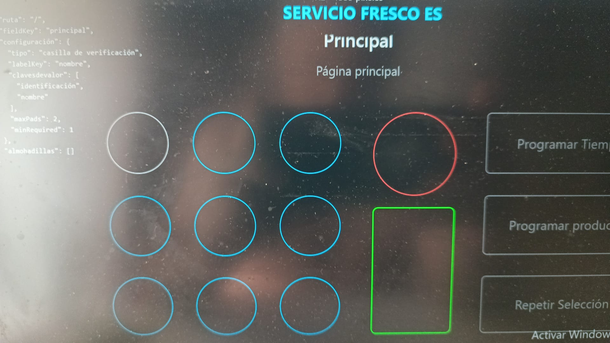
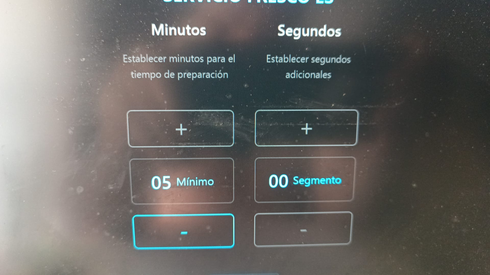
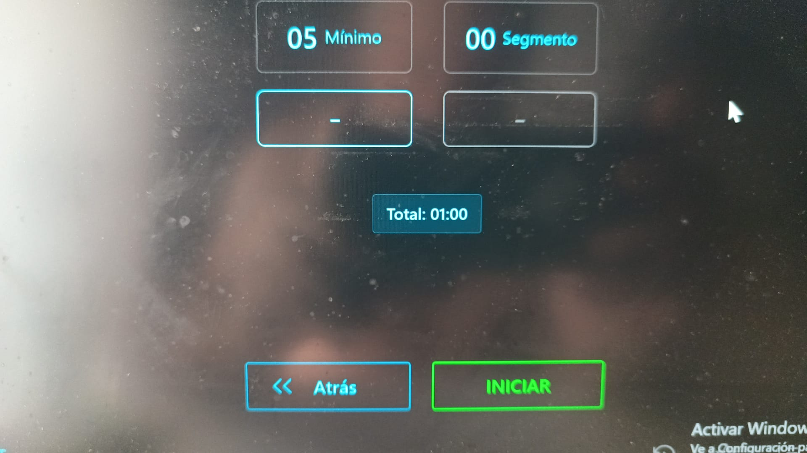
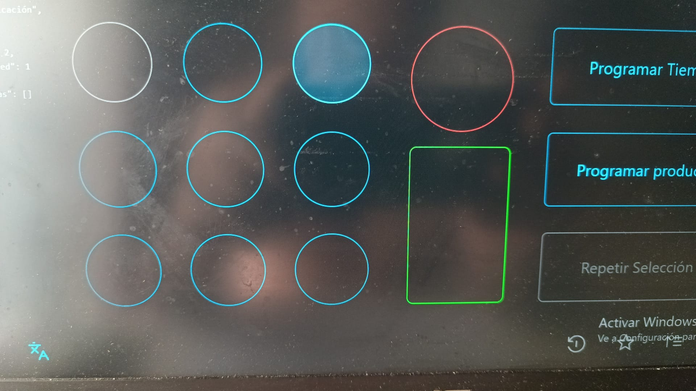
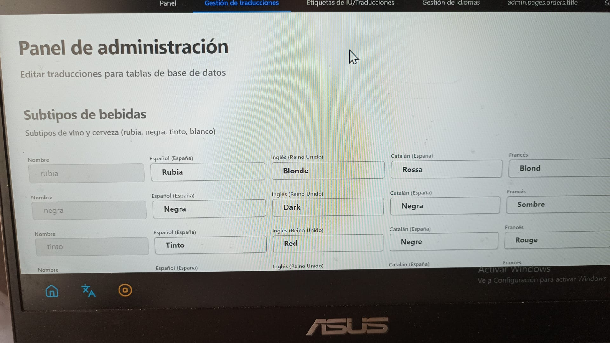

# Bug Report Chat Log - August 26, 2025

## 15:00 - 15:10

- [ ] The "main" and "main page" labels take up space, better to hide them

- [ ] Hide the "set minutes" and "set seconds" labels as well as the "total" label so that the start and back buttons appear higher up and can be seen on the same page without scrolling

## 15:10 - 15:20

- [ ] Could be due to errors when loading the program, it worked the first time
- [ ] Programming a product now gives me an error, it worked the first time, I was even able to make two selections while maintaining the correct times. Then the subtype selection failed, it skipped it, and now I can't even enter

## 15:20 - 15:30

- [ ] If I reload the page sometimes I can get into the subselection but it doesn't work properly

## 15:30 - 15:45

## 15:45 - 16:00

- [ ] This appears when changing the language to English

- [ ] Also, you can't select a new language. Only the three that are set

## 16:00 - 16:30

- [ ] This is the page where the relay that activates each element should be assigned

## 18:05 - 18:15

## Final Notes

- [ ] We'll need a user interface where you can select the mode, select the language, select the alarm sound and adjust the volume, and an option labeled "Defrost" that activates a relay for 3 minutes. All of this can go in the configuration section, leaving the entire admin section as an option within this section that, protected by password, takes us to the admin section you have now.

- [ ] Keep in mind that it will be used on a touch screen, so we'll need the option to show/hide the keyboard for when writing is necessary.

- [ ] On the main page, the green rectangle cannot be selected. It should activate or deactivate a relay. The defrost option is incompatible with the green rectangle, so it must be deselected to turn off the relay it activates.
