# Registro de Errores del Chat - 26 de Agosto, 2025

## 15:10 - 15:20

- [ ] Puede ser por errores al cargar el programa, la primera vez funcionó
- [ ] Programar producto ahora me da error, la primera vez funcionó, hasta pude hacer dos selecciones manteniendo bien los tiempos. Después me falló la selección del subtipo, se la saltaba, y ahora no me deja ni entrar

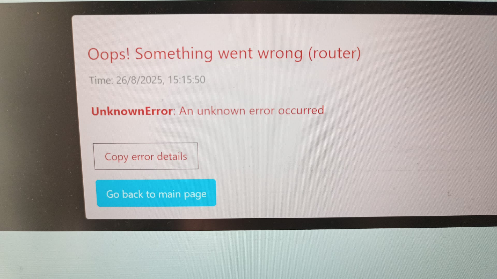

## 15:20 - 15:30

- [ ] Si recargo página a veces me entra en la subselección pero no funciona bien.

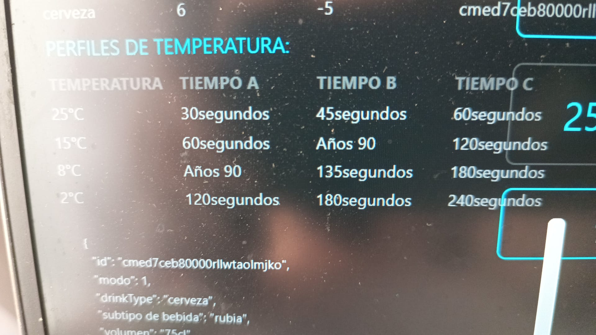

## 15:30 - 15:45

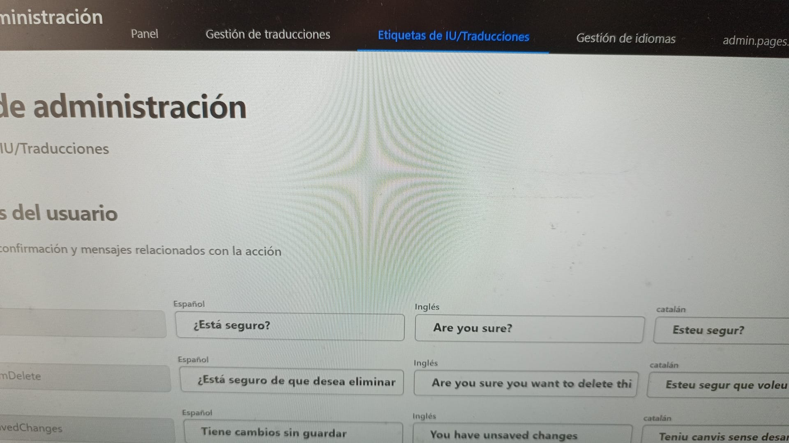
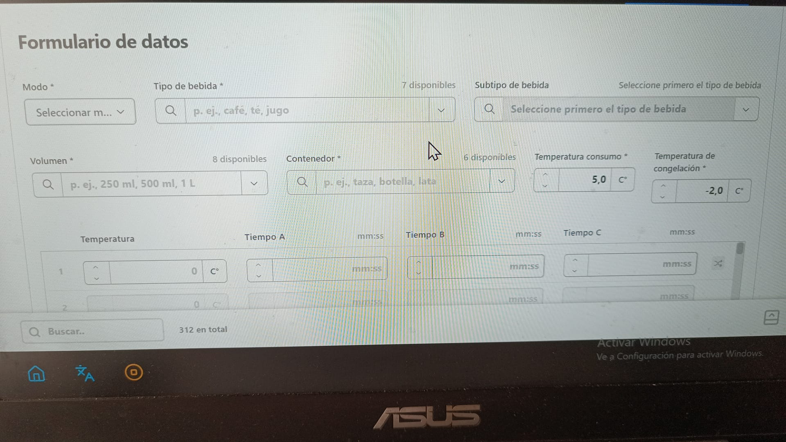
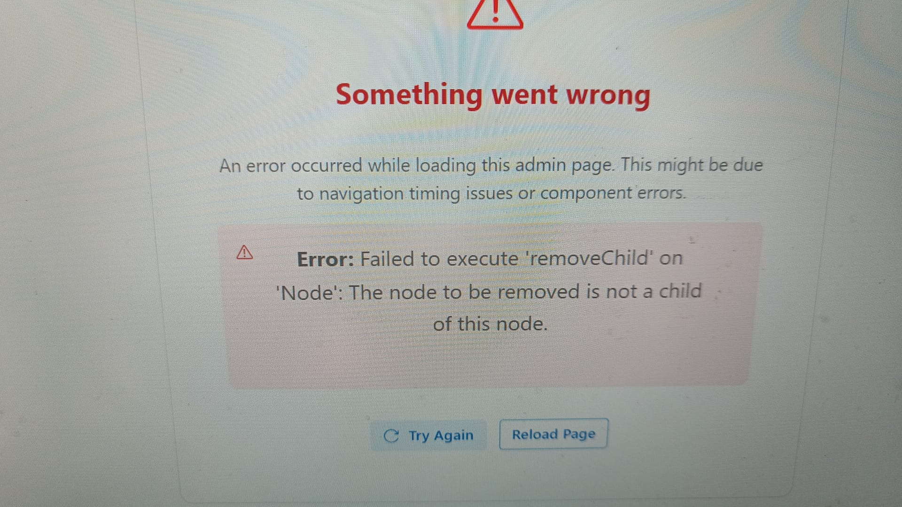

## 15:45 - 16:00

- [ ] Al cambiar el idioma a inglés pone esto

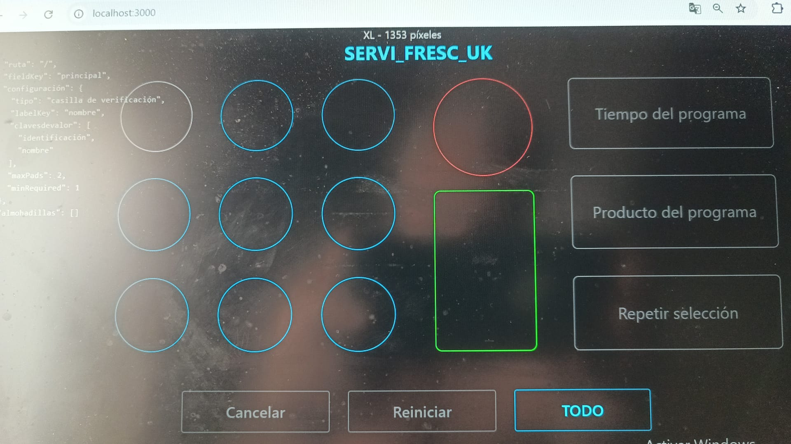
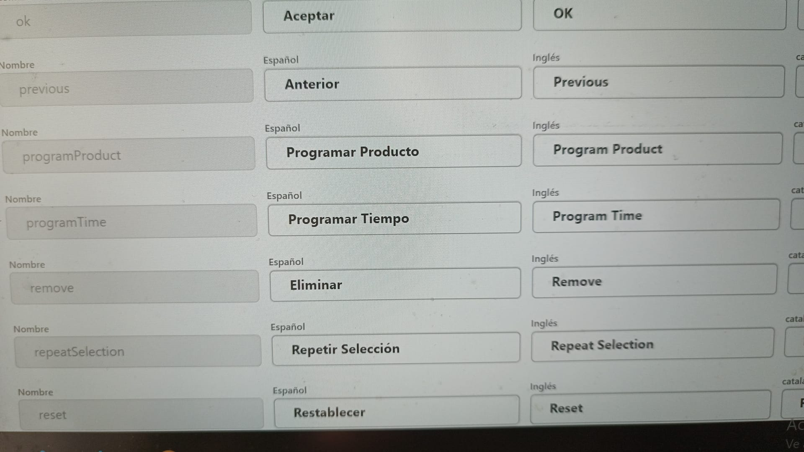
- [ ] Además, no se puede seleccionar un idioma nuevo. Solo los tres que hay puestos

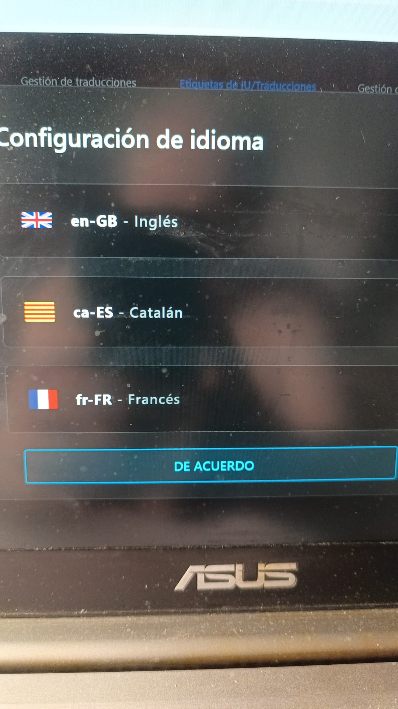

## 16:00 - 16:30

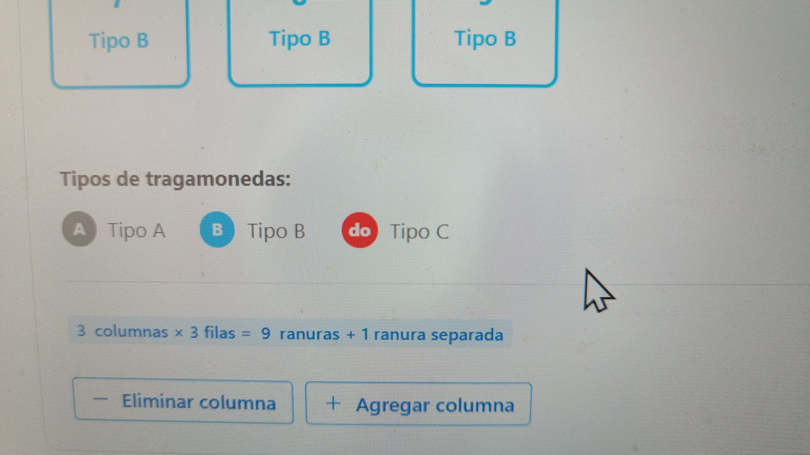
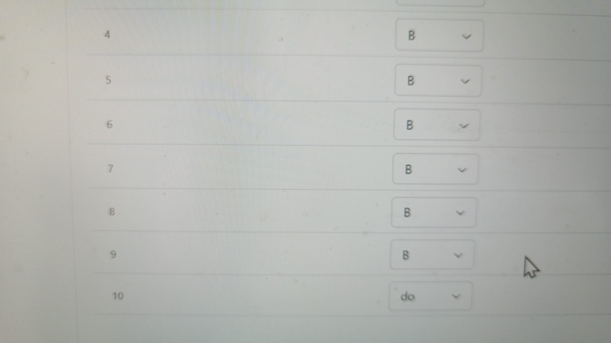
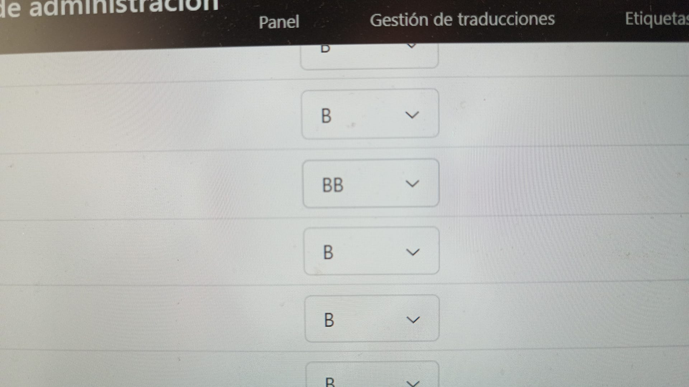
- [ ] En esta página es donde se debería asignar el relé que activa cada elemento

## 18:05 - 18:15

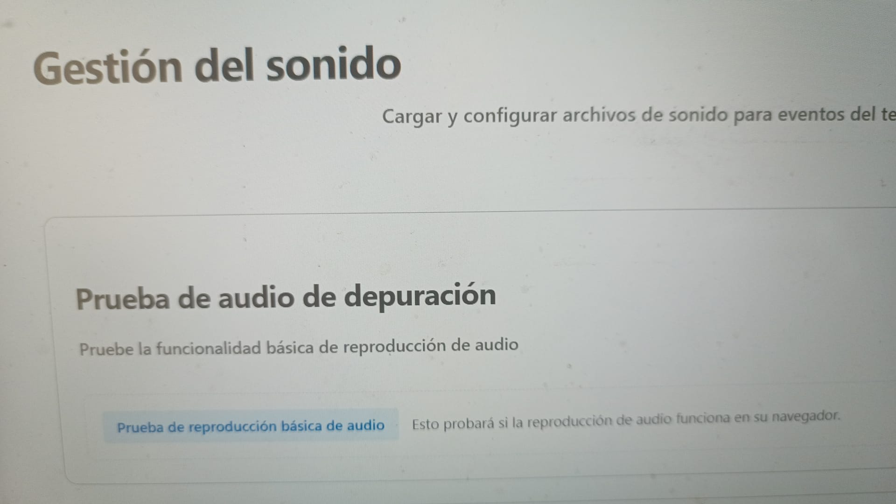
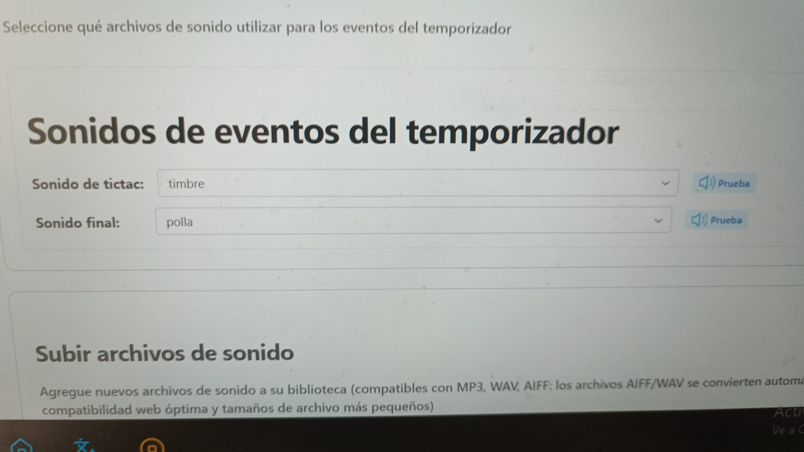
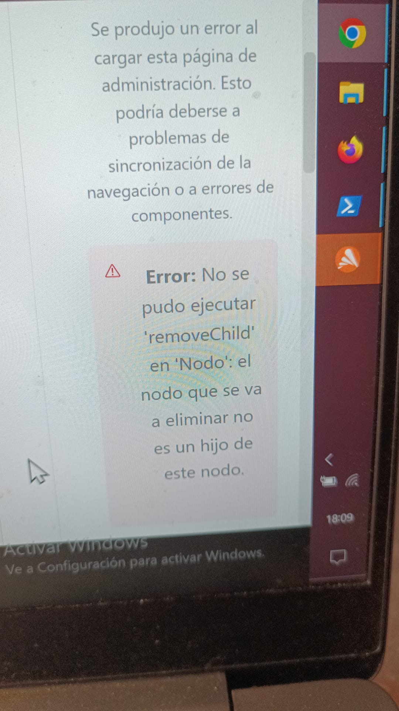

## Notas Finales

- [ ] Faltará una interfaz de usuario donde se pueda seleccionar el modo, seleccionar el idioma, seleccionar el sonido de alarma y ajustar el volumen y una opción que ponga "Desescarche" y que active un relé durante 3 min. Todo esto puede ir en el apartado de configuración, dejando toda la parte de administrador como una opción dentro de este apartado y que, protegido por contraseña, nos lleve a la parte de administrador que tienes ahora.

- [ ] Piensa que se trabajará sobre pantalla táctil por lo que se necesitará la opción de mostrar/ocultar teclado para poder escribir si es necesario.

- [ ] En la página principal el rectángulo verde no se puede seleccionar. Debe activar un relé o apagarlo. La opción desescarche es incompatible con el rectángulo verde por lo que debe deseleccionarlo para apagar el relé que activa.
