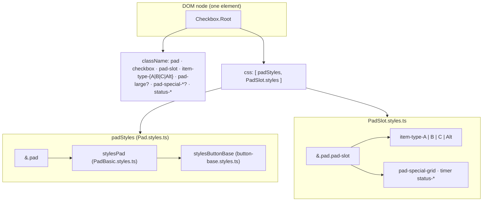
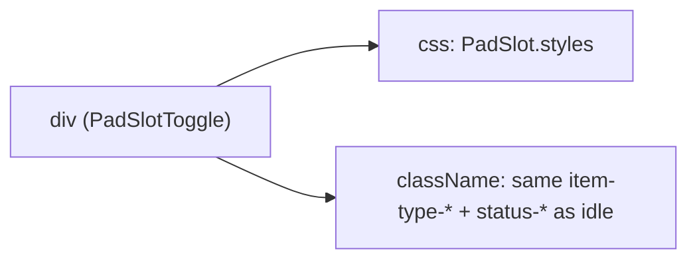

# Main pad / slot styling (inheritance)

Single source for **relay slot** appearance: `PadSlot.styles.ts` (`styles`), merged **after** base checkbox chrome in `Pad.styles.ts` (`padStyles` → `stylesPad` → `stylesButtonBase`).

## Mermaid: idle checkbox path (main grid pad)



## Mermaid: timer path



## ANSI (compact)

```
idle Pad:
  Checkbox.Root
    class: pad + checkbox + pad-slot + item-type-<SlotType|Alt> + …
    css:   [ padStyles → stylesPad → stylesButtonBase ,  PadSlot.styles → item-type-* ]

timer Pad:
  div (PadSlotToggle)
    class: pad + pad-slot + item-type-* + status-processing|…
    css:   PadSlot.styles
```

`item-type-Alt` comes from `SlotSpecial.ALT` (enum value `"Alt"`). Slot **16** is normalized via `resolveMainPageSlotType()` in `slots.config.ts`.
