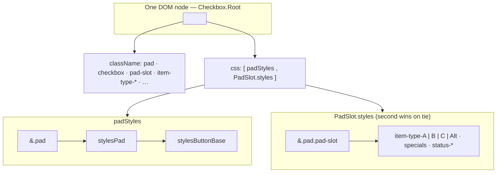
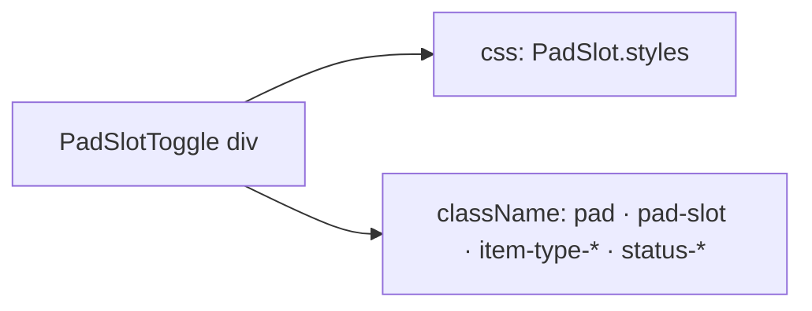

Here’s a concise summary of what was wrong, what we changed, and the diagrams you asked for.

---

## 1. Inheritance (why it felt “stacked”)

**Before:** `PadSlot` passed `css={styles}` into `Pad`, but **`PadCheckbox` always used `css={padStyles}` only** — the slot stylesheet never ran on idle main pads. **`PadSlotToggle` also ignored `css`**, so timer pads had the same issue.

**After (single clear chain):**

| Path                | `className`                                                  | `css` (Emotion)                                              |
| ------------------- | ------------------------------------------------------------ | ------------------------------------------------------------ |
| **Idle relay pad**  | `pad` `checkbox` `pad-slot` `item-type-…` `pad-large?` `pad-special-*?` `status-*` | `[ padStyles, PadSlot.styles ]` → `padStyles` = `&.pad { stylesPad → stylesButtonBase }` |
| **Timer relay pad** | same pattern on `PadSlotToggle`                              | `PadSlot.styles` only (no `padStyles` on that `div`)         |

So **`stylesButtonBase` still applies on idle pads** via `padStyles` → `stylesPad` → `stylesButtonBase`; **`PadSlot.styles` is merged after** for `item-type-*` / specials / timers.

---

## 2. Mermaid diagrams

**Idle checkbox (main pad):**

**Timer path:**

---

## 3. `item-type-Alt` + `SlotSpecial.ALT`

- **`PadSlot`** already did `` `item-type-${slotType}` ``; **`MainSlotGrid` was wrong** — ALT pads used `slotType={SlotType.C}`.
- **`resolveMainPageSlotType(slotNumber, slotType)`** in `slots.config.ts` forces slot **16** to **`SlotSpecial.ALT`** for UI/data derived from API-shaped `SlotType`.
- **`MainSlotGrid`** now passes **`SlotSpecial.ALT`** for ALT `PadSlot`s and **`resolveMainPageSlotType(...)`** for grid slots.
- **`useSlotItemsConfig`** and **session restore** in **`MainPage`** use **`resolveMainPageSlotType`** so `SlotItem` / restored `SlotMeta` stay consistent.
- **`SlotMeta.slotType`** is now **`SlotType | SlotSpecial`**.
- **`PadSlot.styles`**: added **`.item-type-Alt`** (secondary palette); **`.pad-special-alt`** no longer duplicates colors — it’s only a **layout hook** in markup (comment in CSS).

Enum value is **`SlotSpecial.ALT = 'Alt'`**, so the class is **`item-type-Alt`** (matches your expectation).

---

## 4. Doc in repo

`apps/client/docs/pad-slot-style-inheritance.md` has the mermaid + ASCII for future reference.

---

**Files touched:** `Pad.tsx` / `PadCheckbox.tsx` (merge `css`), `PadSlotToggle.tsx` (forward `css`), `PadSlot.tsx` / `MainSlotGrid.tsx`, `slots.config.ts`, `MainPage.tsx` / `MainPage.types.ts`, `useSlotItemsConfig.ts`, `mock-orders.utils.ts`, `PadSlot.styles.ts`, plus the doc above.