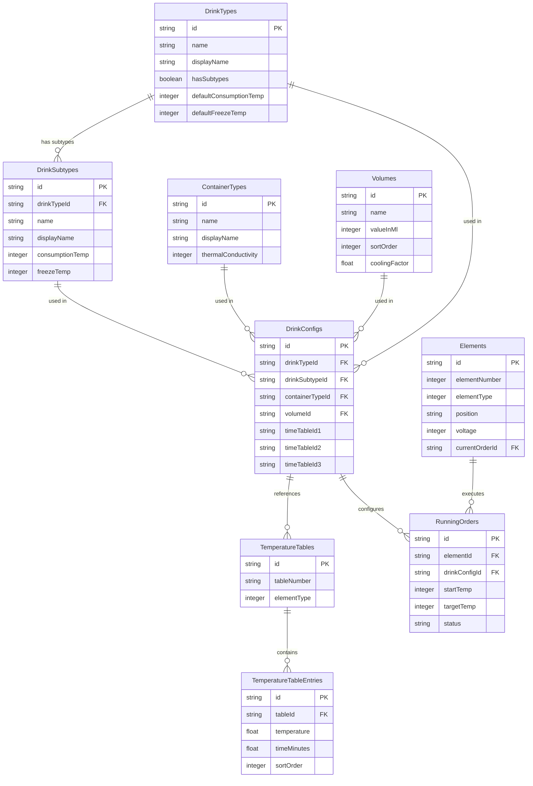

# Touch Monorepo - Database Schemas

## Overview

The database schema is designed for a drink dispensing system with temperature control. The system consists of 11 elements (dispensing stations), where elements 1-10 are drink dispensers and element 11 is a simple on/off switch.

## **Schema** Relationships

## Core Schemas

### `drink_types.schema.ts`

Primary schema for drink categorization:
- **Main Types Table**: Basic drinks (Cerveza, Vino, Licor, etc.)
  - Name and localized display name
  - Temperature defaults (-10°C to 30°C for consumption)
  - Flag for subtypes existence
- **Subtypes Table**: Variants of main types (e.g., Cerveza: Rubia, Negra)
  - References parent drink type
  - Can override parent's temperature settings
  - Maintains same validation patterns

### `container_types.schema.ts`

Defines available container materials:
- Three main types: Plástico, Vidrio, Metal
- Includes thermal conductivity factor for cooling calculations
- Affects cooling time calculations in combination with volume

### `volumes.schema.ts`

Manages available container sizes:
- Standardized volumes (2L, 1.5L, 1.25L, 1L, 75cl, 50cl, 33cl, 25cl)
- Normalizes all volumes to milliliters for calculations
- Includes cooling factor for volume-based timing adjustments
- Maintains sort order for display purposes

### `drink_configs.schema.ts`

Links core entities and defines valid combinations:
- Connects drink types/subtypes with containers and volumes
- Stores temperature ranges and defaults
- References time-temperature tables (1XXX, 2XXX, 3XXX series)
- Enforces valid combinations through foreign key relationships

## Operational Schemas

### `temperature_tables.schema.ts`

Manages temperature-time relationships:
- **Tables Table**: Metadata for temperature-time mappings
  - Table numbers (1XXX, 2XXX, 3XXX format)
  - Element type association (1, 2-9, or 10)
- **Entries Table**: Actual temperature-time data points
  - Temperature in Celsius
  - Time in minutes (decimal precision)
  - Maintains ordered sequence of entries

### `elements.schema.ts`

Controls the 11 dispensing stations:
- Element types (Single: 1,10; Group: 2-9; Switch: 11)
- Physical properties (probe ID, voltage: 12V/24V)
- Current state tracking (in use, remaining time)
- Grid position for UI display
- Temperature probe readings and timestamps

### `running_orders.schema.ts`

Tracks active dispensing operations:
- Links elements to drink configurations
- Monitors temperatures (start, target, current)
- Manages timing (estimated vs actual)
- Status tracking (pending, running, completed, failed)
- Error handling and logging

## Common Features

All schemas include:
- CUID-based primary keys
- Active status flags
- Creation and update timestamps
- Zod validation schemas
- Standard operations structure (select/insert/patch)

## Relationships

- Elements 1-10 use different temperature table series (1XXX, 2XXX, 3XXX)
- Drink configs link to multiple temperature tables
- Running orders connect elements to specific drink configurations
- Elements maintain current order references while active

## Validation

Each schema includes Zod validation for:
- Temperature ranges (-20°C to 40°C)
- Time limits (up to 120 minutes for standard operations)
- Required relationships and foreign keys
- Format-specific fields (e.g., table numbers, positions)
